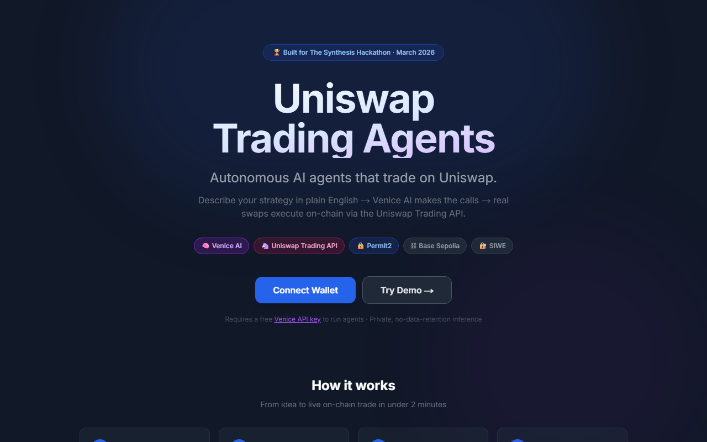
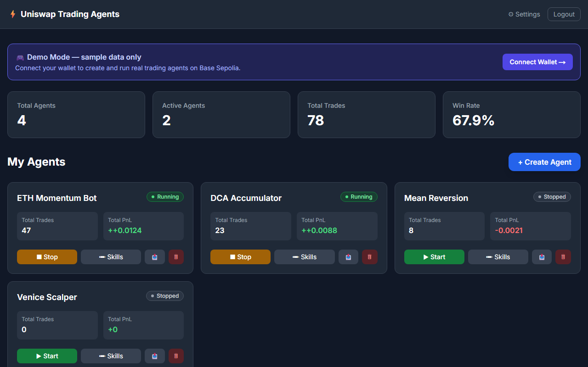
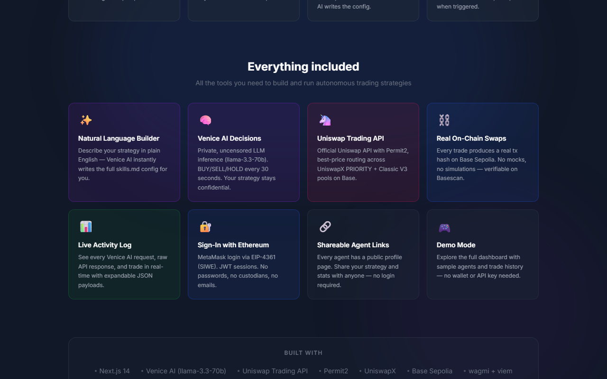
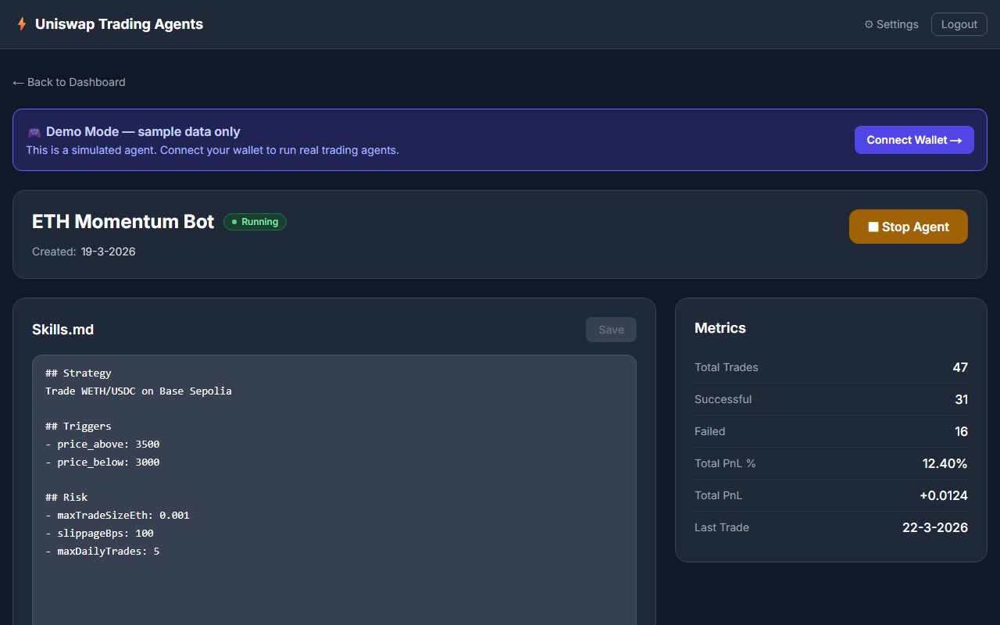
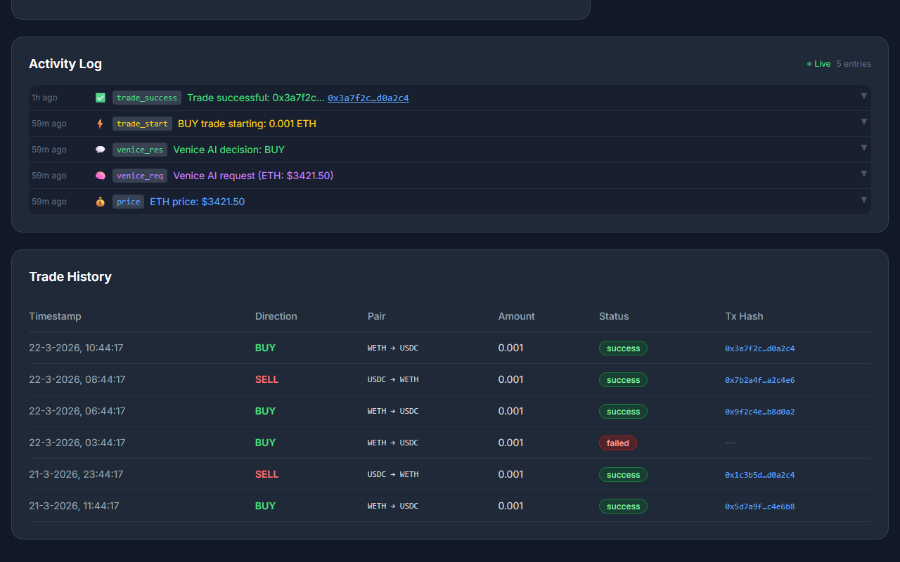

# Uniswap Trading Agents

AI-powered autonomous trading agents that make **real on-chain Uniswap swaps** on Base Sepolia, guided by **Venice AI** using live technical indicators (RSI-14, 24h change %, 7-day MA).

🏗️ **Built for [The Synthesis Hackathon](https://synthesis.devfolio.co)** (March 2026) &nbsp;|&nbsp; 🚀 **[Live Demo](https://frontend-beta-self-40.vercel.app)**

---

## Live Deployment

| Service | URL |
|---------|-----|
| **Frontend** | https://frontend-beta-self-40.vercel.app |
| **Backend API** | https://backend-production-65de.up.railway.app |
| **Health Check** | https://backend-production-65de.up.railway.app/health |
| **GitHub** | https://github.com/michielpost/uniswap-trading-agents |

---

## Screenshots

### Landing Page


### Dashboard (Demo Mode)


### Feature Overview


### Agent Detail + Skills.md Editor


### Activity Log + Trade History with Tx Hashes


---

## Features

- 🤖 **Autonomous AI Agents** — Create trading bots with natural-language `skills.md` strategies
- ✨ **Natural Language Builder** — Describe your strategy in plain English; Venice AI generates the `skills.md` instantly
- 🧠 **Venice AI Decisions** — Private LLM inference (llama-3.3-70b) makes BUY/SELL/HOLD decisions every 30s
- 📈 **Technical Indicators** — Venice AI receives live RSI-14, 24h price change %, and 7-day moving average before every decision
- 🦄 **Uniswap Trading API** — Official Uniswap API (`trade-api.gateway.uniswap.org/v1`) with Permit2, best-price routing across UniswapX + Classic V3/V4
- ⛓️ **Real On-Chain Swaps** — Real tx hashes on Base Sepolia; executor wallet is funded and actively trading
- 🔐 **MetaMask / SIWE Auth** — Sign-In with Ethereum (EIP-4361), JWT sessions
- 📊 **Live Dashboard** — Real-time trade history, PnL, agent status via WebSocket
- 🔍 **Full Activity Log** — Every Venice AI request, Uniswap API call, and tx hash is logged and visible
- 🔗 **Shareable Agent Links** — Public agent profile pages (no login required)
- ⚙️ **Settings Page** — Venice API key management + live wallet balance display
- 🎮 **Demo Mode** — Try the full dashboard with sample agents and trades, no wallet needed

---

## Architecture

```
┌──────────────────────────────────────────────────────────┐
│  Next.js 14 Frontend (Vercel)                            │
│  wagmi · viem · TailwindCSS · MetaMask SIWE              │
└────────────────────────┬─────────────────────────────────┘
                         │ REST + WebSocket
┌────────────────────────▼─────────────────────────────────┐
│  Node.js / Express Backend (Railway)                     │
│  Agent Engine · Venice AI · Uniswap Trading API · JWT    │
│                                                          │
│  Every 30s tick:                                         │
│    CoinGecko → RSI-14 + 24h Δ% + MA7                    │
│    → Venice AI (llama-3.3-70b) → BUY/SELL/HOLD          │
│    → Uniswap Trading API → on-chain tx                  │
└────────────────────────┬─────────────────────────────────┘
                         │ Uniswap Trading API calls
┌────────────────────────▼─────────────────────────────────┐
│  Uniswap Trading API (trade-api.gateway.uniswap.org/v1)  │
│  /check_approval · /quote · /swap · /order               │
│  Best-price routing: UniswapX PRIORITY + Classic V3      │
└────────────────────────┬─────────────────────────────────┘
                         │ Permit2-signed on-chain txs
┌────────────────────────▼─────────────────────────────────┐
│  Base Sepolia Testnet (chain ID 84532)                   │
│  Permit2 · Universal Router · WETH/USDC pool             │
└──────────────────────────────────────────────────────────┘
```

### Key Components

| Layer | Tech | Notes |
|---|---|---|
| Frontend | Next.js 14 App Router | wagmi v2, SIWE, TailwindCSS |
| Backend | Express 4 + WebSocket | JWT auth, rate limiting, Helmet |
| Agent Engine | `agentEngine.js` | 30s tick; fetches indicators + calls Venice AI |
| **Technical Indicators** | **CoinGecko market chart** | **RSI-14, 24h Δ%, 7-day MA — sent to Venice every tick** |
| **Swap Execution** | **Uniswap Trading API** | **`/check_approval` → `/quote` → Permit2 sign → `/swap`/`/order`** |
| AI Decisions | Venice AI (llama-3.3-70b) | Private inference; full market context in prompt |
| NL Builder | Venice AI | Plain-English description → `skills.md` generation |
| Persistence | SQLite (better-sqlite3) | Agents, trades, full activity log |

---

## Technical Indicators in Venice AI Prompt

Before every BUY/SELL/HOLD decision, the agent engine fetches 7 days of hourly ETH price data from CoinGecko and injects a structured market data block into the Venice AI prompt:

```
## Market Data (ETH/USD)
- Price:      $3,420.15
- 24h change: +2.34%
- RSI-14:     28.5 (oversold — potential BUY signal)
- 7-day MA:   $3,280.00 (price is ABOVE MA — bullish signal)
```

Venice AI then reasons over this alongside the agent's `skills.md` strategy and recent trade history to output exactly `BUY`, `SELL`, or `HOLD`.

---

## Uniswap Trading API Integration

Every swap goes through the official [Uniswap Trading API](https://api-docs.uniswap.org):

```
1. POST /check_approval  →  verify Permit2 allowance; broadcast approval tx if needed
2. POST /quote           →  best-price route (UniswapX PRIORITY on Base, or Classic V3)
                             returns Permit2 EIP-712 typed data + amountOut
3. signTypedData (EIP-712) → executor wallet signs Permit2 data
4. POST /swap            →  CLASSIC routing → calldata → broadcast tx
   POST /order           →  UniswapX PRIORITY → gasless filler order
```

**Routing:** On Base, the API returns `PRIORITY` (UniswapX) for competitive quotes or `CLASSIC` for V3 pool routing. Both produce real on-chain execution with verifiable tx hashes on BaseScan.

**Fallback:** If the API returns "No quotes available" (sparse testnet liquidity), the engine falls back to direct SwapRouter02 calls to ensure reliability.

---

## How It Works

1. **Connect Wallet** — MetaMask login via SIWE (EIP-4361)
2. **Add Venice Key** — Settings page (`venice.ai/settings/api`), used for private AI inference
3. **Create Agent** — Describe strategy in plain English → Venice AI generates `skills.md`, or edit manually
4. **Start Agent** — Engine polls every 30 seconds:
   - Fetches 7-day hourly ETH price history from CoinGecko
   - Computes RSI-14, 24h price change %, and 7-day moving average
   - Sends full market context + agent strategy to Venice AI → `BUY`/`SELL`/`HOLD`
   - If BUY/SELL: calls Uniswap Trading API (`/check_approval` → `/quote` → `/swap`/`/order`)
   - Signs Permit2 typed data with executor wallet, broadcasts real on-chain tx
   - Records tx hash in SQLite, visible in real-time activity log
5. **Watch Live** — Dashboard updates via WebSocket; every Venice request, Uniswap API call, and tx hash is logged

### skills.md Format

```markdown
## Strategy
Buy ETH when oversold and below 7-day MA, sell when overbought

## Triggers
- price_above: 3200
- price_below: 2800
- interval_minutes: 30

## Risk
- maxTradeSizeEth: 0.00003
- slippageBps: 200
- maxDailyTrades: 5
```

---

## Trading Wallet (Base Sepolia)

The executor wallet is **funded and actively making real on-chain swaps**:

```
Address:  0xa955929469693b389460BFEaB2c47E3e4362DD01
Network:  Base Sepolia (chain ID 84532)
Explorer: https://sepolia.basescan.org/address/0xa955929469693b389460BFEaB2c47E3e4362DD01
```

**Verified on-chain trades (Base Sepolia):**

| # | Direction | Tx Hash | Explorer |
|---|-----------|---------|---------|
| 1 | BUY (WETH→USDC) | `0x72a13223b4560f9c4bb3021cdc68acff0f5c2b3790faa4a6f1f08c7e0a2e1929` | [view](https://sepolia.basescan.org/tx/0x72a13223b4560f9c4bb3021cdc68acff0f5c2b3790faa4a6f1f08c7e0a2e1929) |
| 2 | BUY (WETH→USDC) | `0xb1cc7ec6082f4e78d262cdca9b3abc1ffed861300ea00c2e6e610f403fdb7f5a` | [view](https://sepolia.basescan.org/tx/0xb1cc7ec6082f4e78d262cdca9b3abc1ffed861300ea00c2e6e610f403fdb7f5a) |
| 3 | BUY (WETH→USDC) | `0xc9d7f546db218585217cb7d4d8abbb8e0db3586a70d860c2be153e7eed36399b` | [view](https://sepolia.basescan.org/tx/0xc9d7f546db218585217cb7d4d8abbb8e0db3586a70d860c2be153e7eed36399b) |
| 4 | SELL (USDC→WETH) | `0x4d5fcc4f599c2991854ad9fc35309be35cdbabcdc09ba1080cef0893ea2eb3d5` | [view](https://sepolia.basescan.org/tx/0x4d5fcc4f599c2991854ad9fc35309be35cdbabcdc09ba1080cef0893ea2eb3d5) |

**Token addresses (Base Sepolia):**

| Token | Address |
|-------|---------|
| WETH  | `0x4200000000000000000000000000000000000006` |
| USDC  | `0x036CbD53842c5426634e7929541eC2318f3dCF7e` |

**Contracts (fallback path):**

| Contract | Address |
|----------|---------|
| SwapRouter02 | `0x94cC0AaC535CCDB3C01d6787D6413C739ae12bc4` |
| QuoterV2     | `0xC5290058841028F1614F3A6F0F5816cAd0df5E27` |

---

## Environment Variables

| Variable | Description |
|---|---|
| `UNISWAP_API_KEY` | Uniswap Developer Platform API key |
| `EXECUTOR_PRIVATE_KEY` | Hex private key of the executor wallet |
| `RPC_URL` | Base Sepolia RPC (default: `https://sepolia.base.org`) |
| `CHAIN_ID` | Chain ID (default: `84532`) |
| `JWT_SECRET` | Secret for JWT session tokens |
| `VENICE_API_KEY` | Venice AI API key (per-user; stored encrypted in settings) |

---

## Local Development

```bash
git clone https://github.com/michielpost/uniswap-trading-agents.git
cd uniswap-trading-agents

# Backend
cd backend
cp .env.example .env
# Fill in: JWT_SECRET, EXECUTOR_PRIVATE_KEY, UNISWAP_API_KEY, RPC_URL
npm install
npm run dev

# Frontend (new terminal)
cd frontend
cp .env.example .env.local
# Set: NEXT_PUBLIC_BACKEND_URL=http://localhost:4000/api
npm install
npm run dev
```

Open http://localhost:3000 and connect MetaMask.

---

## Documentation

- [Development Log](CONVERSATION_LOG.md) — Full build history with every decision documented
- [Uniswap Trading API Docs](https://api-docs.uniswap.org) — Official API reference
- [Venice AI](https://venice.ai) — Private AI inference provider

---

## Hackathon Tracks

| Track | Notes |
|-------|-------|
| **Agentic Finance (Uniswap API)** | Official Uniswap Trading API, Permit2 signing, UniswapX + Classic routing, real API key |
| **Autonomous Trading Agent** | Real on-chain swaps, RSI+MA technical indicators, Venice AI strategy engine, SQLite activity log |
| **Private Agents, Trusted Actions (Venice)** | Venice AI for private BUY/SELL/HOLD inference with market context + NL `skills.md` generation |
| **Agent Services on Base** | Agents deploy and execute trades on Base Sepolia |
| **Synthesis Open Track** | Full-stack AI trading platform with demo mode, NL builder, real indicators |

**Participant ID:** `0ebb1a075bcd4fdcb5563bd8ae37d97b`

---

## License

MIT